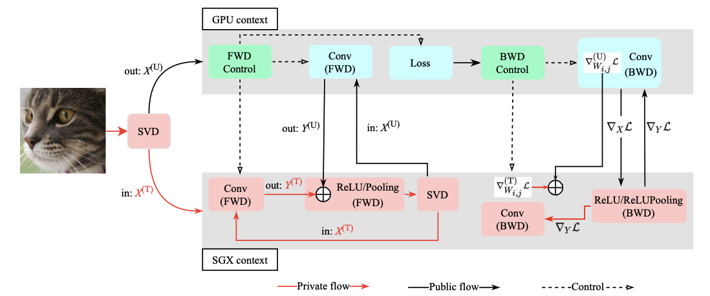

# AsymML

## Introduction
An *AsymML* ML framework which automatically splits a DNN model in an asymmetric manner, 
then distributes the respective computations into trusted platform (Intel SGX-enabled CPUs) and untrusted platform (GPUs). 
The trusted platform keeps most sensitive information with small computation cost. 
On the other hand, the untrusted platform undertakes most computation with little information leaked.



Figure above shows an overview of the asymmetricML framework. 
There are two running contexts running in parallel: **GPU context** acts as convolutional layer acceleration, model update; 
**SGX context** conducts computations on sensitive data, such as partial convolutional layers, ReLU layers, Pooling layers.

A dedicated DNN library is implemented inside TEEs. 
Currently, it supports Conv (FWD/BWD), ReLU(FWD/BWD), and Pooling(FWD/BWD) is supported. 
To further reduce memory operations, a Pooling op is further fused with a ReLU op before it. 
Beside of DNN ops, a light SVD approximation op is also included to calculate *principle channels* on the fly. 
Since current SGX SDK does not support common tensor libraries as TensorFlow, PyTorch, even Intel MKL, 
we adopt Eigen3 and recompile it to fit into the SGX environment.

## Dependencies
- Python == 3.9
- PyTorch == 1.11.0
- CUDA == 11.2
- Numpy == 1.20.3
- [Intel SGX Driver/SDK](https://github.com/intel/linux-sgx)
- [Eigen3](https://gitlab.com/libeigen/eigen/tree/master)

## DIR
```
./
|
|-main.py: main run
|
|-App: C++ untrusted code
|
|-Enclave: C++ trusted code
|
|-Include: C++ header files
|
|-python: python code
|
|-miAttack.py: a script for performing model inversion attacks
|
|-dgAttack.py: a script for performing gradient attacks
```

## Compile
C++ code of SGX context needs to be compiled first to generate a shared library: *libenclave.signed.so*. 
This shared library will be embedded into PyTorch context using *ctypes*. Compilation needs Intel SGX SDK installed.

- Simulation mode
```bash
make clean && make SGX_MODE=SIM SGX_DEBUG=0 2> tmp
```
- Hardware mode
```bash
make clean && make SGX_MODE=HW SGX_DEBUG=0 2> tmp
```

## Run
- Train VGG16 using GPU
```bash
CUDA_VISIBLE_DEVICES=0 python main.py --device=gpu --batch-size=32 --model=vgg16 --dataset=imagenet
```

- Train VGG16 using GPU and SGX
```bash
CUDA_VISIBLE_DEVICES=0 python main.py --device=gpu --batch-size=32 --model=vgg16 --dataset=imagenet --sgx
```

For other models, like ResNet, only the running arguments *--model* needs to be changed.

Note: to support SGX-only execution, SGX context code needs to be recompiled with ***SGX_ONLY***(*./Enclave/dnn_sgx.h*) enabled; 
meanwhile, flag in PyTorch context ***SGX_ONLY***(*./python/dnn_sgx.py*) should be set to be *True*.

- Model inversion attack
```bash
python miAttack.py
```

- Gradient inversion attack
```bash
python dgAttack.py --image=a sample image
```